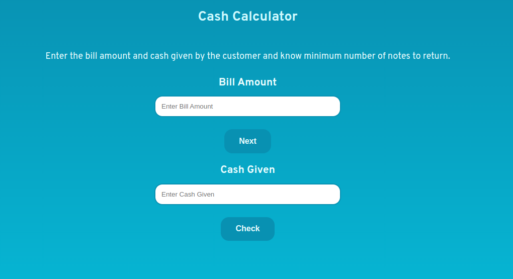
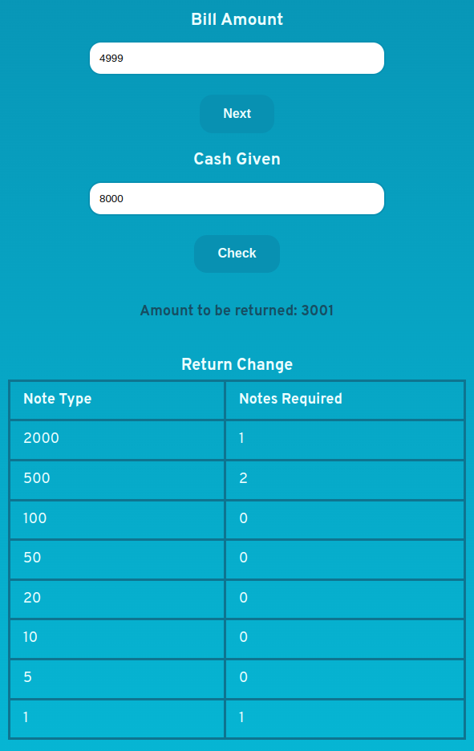

# Cash Register Manager

## Made Using HTML, CSS and JavaScript

Isn't it very messy when you pay more than your bill amount because you don't have enough change and then you get so many notes in return which you don't even feel like counting? This web-app does the job for you! It can tell you how much refund you will get and the minimum number of notes you get as well!

**Cash Register Manager** provides you with a **claculator** where you can enter your **bill amount** and **the amount of cash you gave**, in their specified fields. Then you need to click on the **check button** to calculate the **refund amount**.

**Note:** The cash given input field will get displayed once you fill a valid bill amount and click on the **Next** button.

- **Calculator Input and Buttons**

After clicking on the check button, the **refund table** located below the check button will display the minimum notes that you can get according to the refund amount. Above the table, and below the check button, you can see the refund amount as well. Any errors will be shown there too.

**Note:** The Refund Table will only get displayed once you fill a valid cash given amount and click on the **Check** button. It will also not get displayed if the bill amount is same as cash given amount.

- **Refund Table**

***
#### LET THE APP DO THE MATH!
